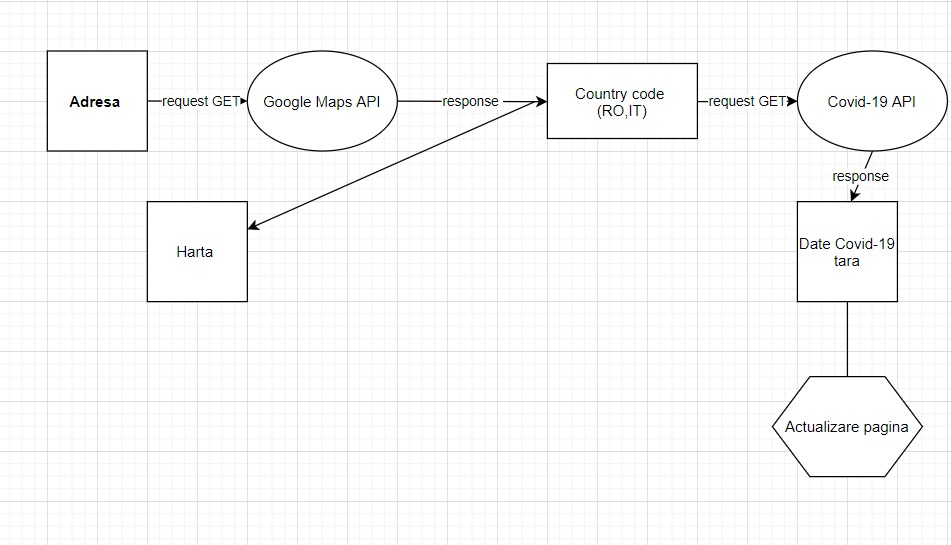
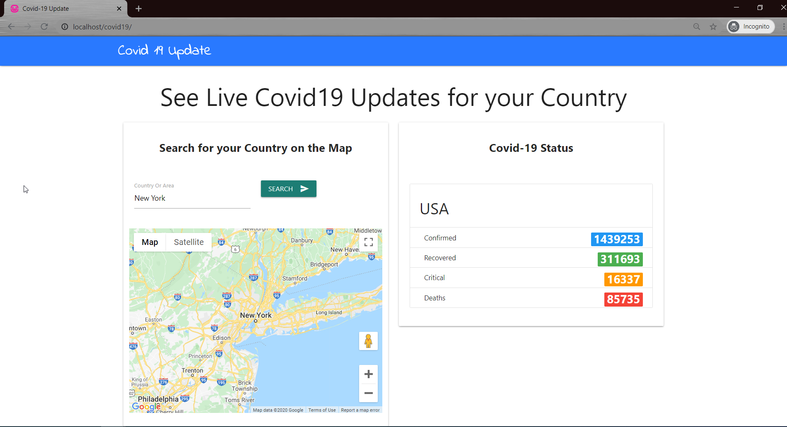
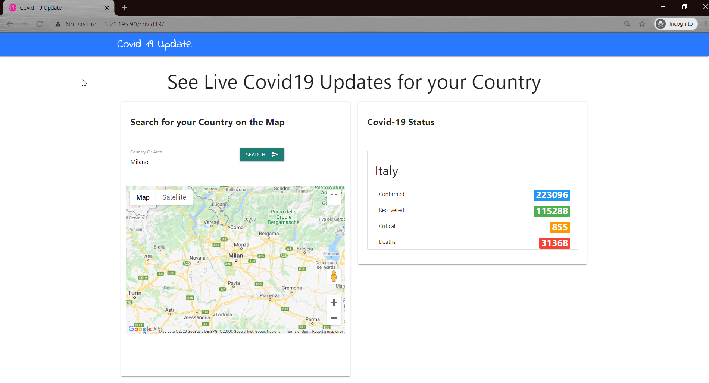
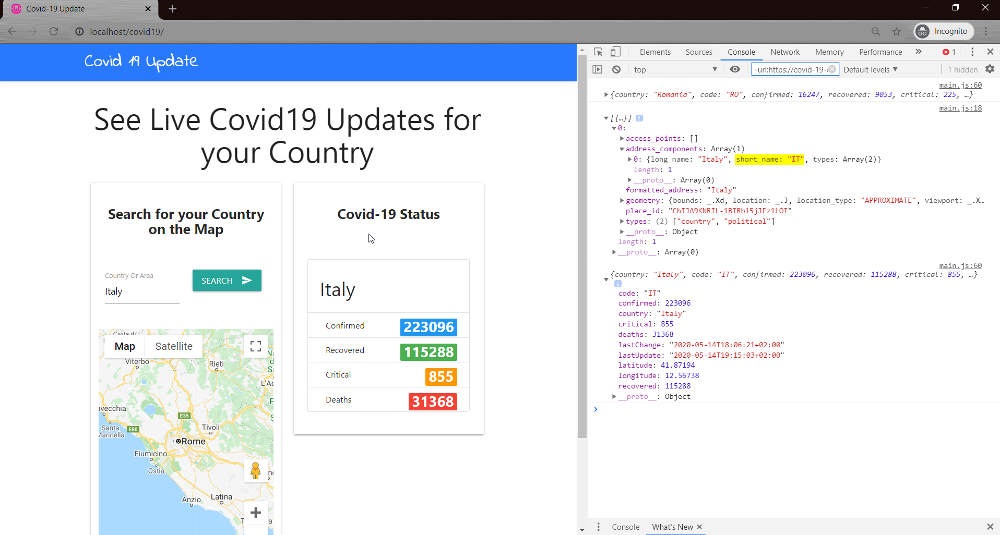

# covid19

1. Introducere 

Crearea unei aplicatii web care sa utilizeze doua servicii in cloud, prin intermediul unui API REST.
Am folosit 2 API-uri publice: 
	- Google Maps: partea de geocoding
	- COVID-19 data: un API disponibil pe rapidapi.com, care pune la dispozitie date actualizate legate de Coronavirus pentru o anume tara.
Tehnologii folosite:
	- pagina web: HTML, CSS, JavaScript (JQuery), iar request-urile catre API-uri sunt realizate prin Ajax.
	- web server: Apache (din suita WampServer)
	- hostare: pagina web este publicata in web server-ul Apache, instalat pe o instanta de Windows Server 2019 (AWS) 
	- pagina web este disponibila public la adresa IP a masinii virtuale AWS

2. Descriere problema:

Infecția cu virusul COVID-19(SARS-Cov-2) a apărut în decembrie 2019 în orașul Wuhan, China, de unde s-a propagat în majoritatea provinciilor chineze și majoritatea țărilor din lume, 
provocând o pandemie.Epidemia cauzată de noul virus are un impact asupra intregii populatii, astfel site-ul va ajuta la informarea cu privire la situatia numerica la nivel global, fiind
actualizat zilnic. Totodata va reprezenta o sursa de informare, nealimentată de panică, unde sunt actualizate statisticile privitoare la numărul de pacienți afectați de acest virus. 
Pagina noastra vă oferă o privire de ansamblu asupra statisticilor. Astfel, statisticile oferite includ numărul de cazuri confirmate, numarul de cazuri recuperate, numărul de cazuri critice si numarul de decese.
În cadrul acestui site datele pot fi un punct de reper esential in stabilirea situatiei in care se afla fiecare tara in parte.
Aceste date pot fi mai apoi subiectul unor analize statistice la momentul actual sau chiar pentru previzionari viitoare.`
Viteza de incarcare a site-ului este una rapida.
Se doreste ca pagina sa fie una accesibila, care poate fi utilizat de către orice persoană, indiferent ce echipament hardware sau browserul folosit.

3. Descriere API:

-Google Maps API:
Din suita Google Maps API am folosit functia de Geocoding, transforma o adresa textuala in coordonate geografice: latitudine si longitudine, ce pot fi reprezentate ca un punct pe harta.
Aditional, raspunsul de la Google Maps contine si detalii despre tara corespunzatoare adresei, printre care si codul tarii (ex: RO, IT,...), ce este trimis in request catre API-ul care returneaza statisticile Coronavirus. 

-Covid-19 Data API:
Este un API disponibil pe rapidAPI.com, care pune la dispozitie mai multe endpoint-uri care ofera statistici legate de cazurile Covid19 structurate per tara.
Datele acestui API provin din surse oficiale ale fiecarei tari si sunt actualizate in fiecare zi.
Dintre endpoint-urile disponibile, am folosit getLatestCountryDateByCode, care foloseste un request HTTP de tip GET ce primeste codul tarii(obtinut din response-ul Google Maps) si returneaza
statisticile Covid-19(cazuri confirmate, recuperate, critice, decese).

4. Flux de date:

Pagina web nu foloseste o baza de date proprie, datele disponibile provenind din serverele cloud ale celor doua API-uri folosite.
Utilizatorul introduce o adresa, care va fi afisata pe harta de la Google, iar din response-ul de la Google Maps se trimite mai departe codul tarii catre API-ul COVID-19, ce returneaza statisticile pentru tara respectiva.
Cand request-ul Covid-19 este finalizat, se actualizeaza datele din pagina web cu raspunsul primit.

4.1.1 Exemple de request/response:

Pentru ambele API-uri am folosit request-uri HTTP de tip GET.
In campul din pagina web corespunzator adresei este introdus textul: Bucuresti si se realizeaza requestul catre Google Maps care transforma aceasta adresa in coordonate geografice(latitudine si longitudine: 44.4267674, 26.1025384), permitand translatarea adresei textuale intr-un punct pe harta.
Raspunsul de la Google Maps furnizeaza, in afara datelor geografice si adresa completa, incluzand si tara. De exemplu, pentru cazul prezentat raspunsul va contine Romania, RO.
Codul tarii(RO) este trimis ca parametru in requestul HTTP GET catre API-ul COVID-19, iar acesta returneaza urmatoarele date:
	- code: "RO"
	- country: "Romania"
	- confirmed: 16247
	- critical: 225
	- deaths: 1046
	- recovered: 9053
	- lastUpdate: "2020-05-14T18:15:03+02:00"

4.1.2. Metode HTTP

Pagina web foloseste 2 request-uri HTTP de tip GET, unul pentru API-ul Google Maps si unul pentru API-ul COVID-19.

4.1.3. Autentificare si autorizare servicii utilizate

Autentificarea requesturilor catre cele doua API-uri se face prin API key-uri, ce sunt introduse in url-ul request-ului.
Exista 2 API key-uri separate pentru cele 2 API-uri.

5. Capturi ecran aplicatie

- schema request-uri: 
- pagina web in urma cautarii statisicilor pentru covid19 pentru New York: 
- pagina web in urma cautarii statisicilor pentru covid19 pentru Milano: 
- pagina web in urma cautarii statisicilor pentru covid19 pentru Italia, cu raspunsurile in format json de la cele doua API-uri: 

6. Hosting

Pagina web este deployed intr-un Bucket prin serviciul web Amazon S3 ca un fisier .zip ce contine un director cu sursele proiectului: fisierul .html, fisierul .css si fisierul .js.
Publicarea paginii web este realizata prin intermediul unui web server Apache din suita WampServer, care este instalata pe o instanta de Windows Server 2019 creata prin serviciul Amazon EC2.
Procesul de publicare a paginii web presupune dezarhivarea arhivei din Amazon Bucket si copierea directorului cu sursele paginii web obtinut la calea unde este instalata suita WampServer, in directorul www.
(Ex: C:\wamp64\www\covid19\), unde 'covid19' reprezinta directorul copiat, care contine sursele paginii web.

7. Pasi de configurare

7.1. Configurari din consola Amazon EC2:

	- Crearea unei instante de Windows Server 2019
	- Configurarea Security Group-ului instantei pentru a permite accesarea paginii web din exterior. Astfel, a fost adaugat un Inbound Rule care permite traficul HTTP pe portul 80 pentru orice adresa IP.
	- Atasarea unui Elastic IP public instantei, care este static si nu se modifica la repornirea instantei, pentru ca pagina web sa fie disponibila intotdeauna la aceeasi adresa.
7.2. Configurari in cadrul instantei de masina virtuala Amazon:

	- Adaugarea unui Inbound Rule in Windows Firewall care sa permita accesarea adresei IP a masinii din exterior: adaugarea unei reguli care sa permita traficul HTTP pe portul 80.
	- In cadrul masinii virtuale de Windows a fost instalata suita WampServer, care contine un web server Apache.
7.3. Configurari in cadrul web server-ului Apache:

	- Permiterea accesului tuturor host-urilor la pagina web publicata in cadrul acestui web server.
